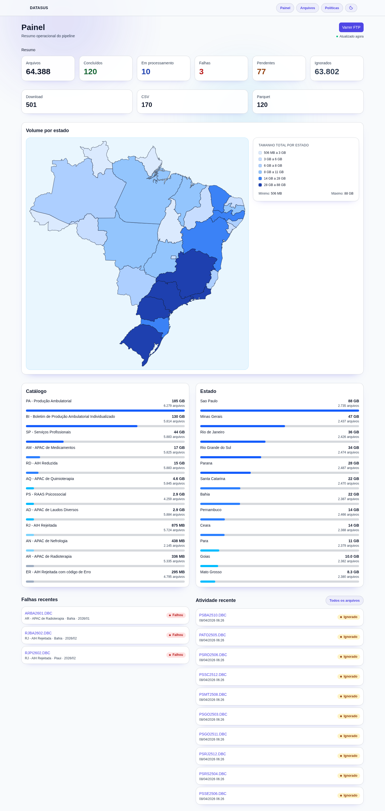
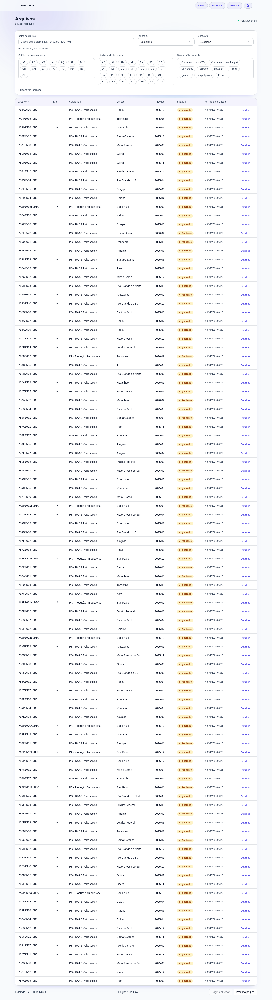
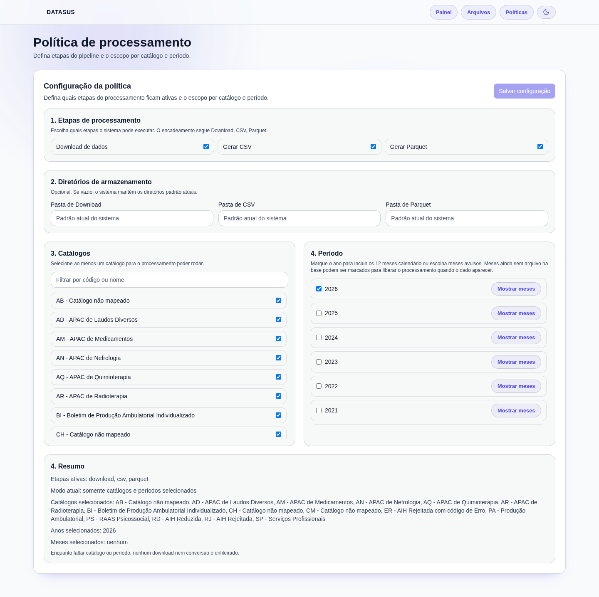

# DATASUS Pipeline

ETL pipeline for Brazilian DATASUS datasets, focused on scanning FTP folders, downloading `.dbc` files, converting them to CSV and Parquet, and exposing operational controls through an API and web UI.

## O que tem aqui

- Go API (`cmd/api`) para health, métricas, consulta de arquivos e triggers do pipeline.
- Go worker (`cmd/worker`) com filas de processamento assíncrono.
- PostgreSQL para metadados, estágios, logs e orquestração de jobs.
- Next.js web app (`web`) para inspecionar arquivos e status.
- Docker Compose stack para ambiente local completo.

## Arquitetura (visão geral)

1. A API varre os caminhos FTP configurados na inicialização e em schedule diário.
2. Novos arquivos são registrados no Postgres e jobs são enfileirados.
3. Worker pools processam os estágios:
   - download `.dbc`
   - conversão para CSV
   - conversão para Parquet
4. API e web app expõem status, logs e ações manuais.

## Requisitos

- Docker + Docker Compose

## Quick start

1. Crie o arquivo de ambiente local:

```bash
cp .env.example .env
```

2. Suba tudo:

```bash
docker compose up --build -d
```

3. Acesse os serviços:

- Web: <http://localhost:3002>
- API: <http://localhost:8080/api/health>
- Metabase: <http://localhost:3001>

### Metabase (primeiro acesso)

O Compose provisiona um banco Postgres dedicado `metabase` para os metadados internos do Metabase (os dados do pipeline ficam em `datasus`). A conexão usa `sslmode=disable`.

Após o `docker compose up --build -d`, rode o helper de setup uma vez:

```bash
make metabase-setup
# ou: python scripts/metabase_setup.py
```

Credenciais padrão (sobrescreva com env vars se precisar):

- URL: `http://localhost:3001` (`METABASE_URL`)
- Admin email: `admin@datasus.local` (`METABASE_ADMIN_EMAIL`)
- Admin password: `MetabaseLocal#2026` (`METABASE_ADMIN_PASSWORD`)

Para adicionar o banco manualmente: PostgreSQL, host **`db`**, porta **5432**, banco **`datasus`**, usuário **`datasus`**, senha **`datasus`**, SSL desligado.

---

## Guia de uso da interface web

### Painel principal

A primeira tela é o **Painel** — o centro de controle do pipeline.



| Bloco | O que mostra |
|---|---|
| **Resumo** | Contadores totais: arquivos baixados, convertidos para CSV e Parquet |
| **Volume por estado** | Tamanho acumulado de arquivos por UF |
| **Catálogo / Estado** | Distribuição dos arquivos por catálogo e estado |
| **Falhas recentes** | Últimos jobs que terminaram com erro |
| **Atividade recente** | Feed de eventos do pipeline em tempo real |

Para forçar uma varredura do FTP sem esperar o cron diário, clique em **Varrer FTP** no topo do painel. A varredura é assíncrona — os novos arquivos aparecem na aba Arquivos assim que o worker terminar.

---

### Arquivos

A aba **Arquivos** lista todos os arquivos registrados, com status e rastreabilidade por estado.



**Filtrar por status:**

| Filtro | O que inclui |
|---|---|
| **Prontos para uso** | Arquivos com Parquet gerado (`parquet_ready`) |
| **Em processamento** | Download, conversão CSV e Parquet em andamento |
| **Todo o histórico** | Todos os estados desde o download |

**Filtrar por estado:** clique em qualquer UF na lista lateral. A URL reflete o filtro — dá para bookmarkar ou compartilhar:

```
/files?state=SP
/files?status=parquet_ready
```

---

### Políticas de processamento

A aba **Políticas** controla o que o pipeline processa e como.



A configuração segue quatro passos:

**1. Etapas de processamento** — escolha quais etapas o sistema executa. O encadeamento é fixo:

```
Download → CSV → Parquet
```

Desligar uma etapa faz o worker processar apenas o que já está no estágio anterior.

**2. Diretórios de armazenamento** — opcional. Se deixar em branco, o sistema usa os diretórios padrão da variável `STORAGE_ROOT`.

| Campo | Caminho padrão |
|---|---|
| Pasta de Download | `STORAGE_ROOT/download` |
| Pasta de CSV | `STORAGE_ROOT/csv` |
| Pasta de Parquet | `STORAGE_ROOT/parquet` |

**3. Catálogos** — selecione ao menos um. Sem catálogo, nenhum job é enfileirado.

**4. Período** — marque anos inteiros ou meses avulsos. Meses sem arquivo disponível no FTP podem ser marcados antecipadamente; o worker os busca assim que o dado aparecer.

O bloco **Resumo** no final da página confirma o estado atual da política antes de salvar.

---

### Acompanhar o progresso

Após configurar a política, volte ao **Painel**:

1. Os contadores de **Resumo** sobem conforme os arquivos avançam nos estágios.
2. **Atividade recente** mostra cada evento com timestamp.
3. **Falhas recentes** agrupa erros com contexto para investigar.

Para inspecionar um arquivo específico, abra **Arquivos**, localize o registro e veja os detalhes de cada estágio com logs individuais.

---

## Comandos úteis

Na raiz do repositório:

- `make build` — compila todos os pacotes Go.
- `make test` — roda os testes unitários.
- `make test-integration` — roda os testes de integração.
- `make up` — sobe o stack Docker.
- `make down` — derruba o stack Docker.
- `make logs` — acompanha os logs do Compose.

## Principais endpoints da API

Base path: `/api`

- `GET /health`
- `GET /metrics`
- `GET /files`
- `GET /files/{id}`
- `GET /files/{id}/stages`
- `GET /stats`
- `POST /scan` (trigger manual, assíncrono)
- `GET /scan/status`
- `POST /download`
- `POST /download/mask`
- `POST /convert/csv`
- `POST /convert/csv/mask`
- `POST /convert/parquet`
- `POST /convert/parquet/mask`
- `POST /purge`

## Configuração

Variáveis de ambiente documentadas em `.env.example`. As mais relevantes:

- `FTP_HOST`, `FTP_PATHS`, `FTP_CONN_POOL`
- `DATABASE_URL`
- `STORAGE_ROOT`
- `CRON_SCHEDULE`, `FTP_SCAN_TIMEOUT`
- `DOWNLOAD_WORKERS`, `CSV_WORKERS`, `PARQUET_WORKERS`
- `RETRY_BASE_DELAY`, `RETRY_MAX_DELAY`, `STUCK_JOB_TIMEOUT`
- `LOG_LEVEL`, `API_PORT`

## Padrão de datas (UI)

Todas as datas exibidas na interface usam formato brasileiro com locale `pt-BR`:

- Só data: `dd/MM/yyyy`
- Data e hora: `dd/MM/yyyy HH:mm`
- Logs e auditorias: `dd/MM/yyyy HH:mm:ss`

Contratos de API mantêm timestamps em ISO/RFC3339. A formatação para exibição usa os helpers em `web/src/lib/dateFormat.ts`. O fuso exibido segue o fuso local do browser do usuário.
