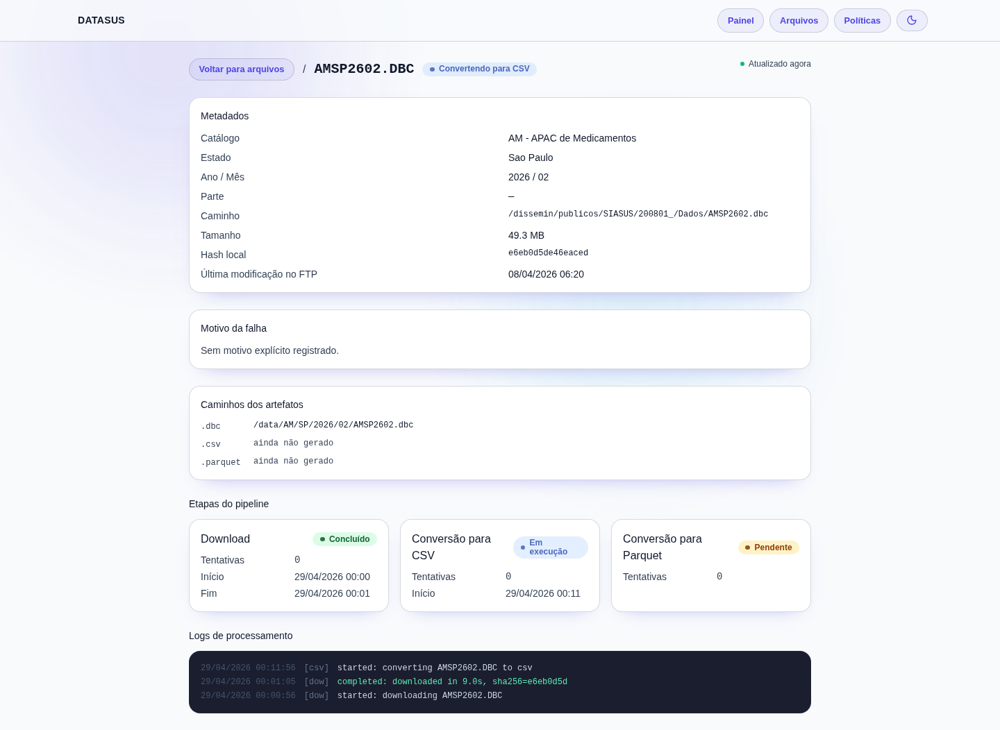

# DATASUS Pipeline

Pipeline ETL para datasets do DATASUS: varre FTP, baixa arquivos `.dbc` e converte para CSV e Parquet.

**Stack:** Go API + Go Worker + PostgreSQL + Next.js — tudo via Docker Compose.

## Subindo

```bash
cp .env.example .env
docker compose up --build -d
```

- Web: <http://localhost:3002>
- API: <http://localhost:8080/api/health>
- Metabase: <http://localhost:3001>

### Metabase

Na primeira vez, rode o helper após o compose subir:

```bash
make metabase-setup
```

Credenciais padrão: `admin@datasus.local` / `MetabaseLocal#2026`. Para conectar manualmente: PostgreSQL, host `db`, porta `5432`, banco/user/senha `datasus`, SSL desligado.

## Interface web

### Painel


Visão geral do pipeline: contadores por estágio, volume por estado, falhas recentes e atividade em tempo real. O botão **Varrer FTP** força uma nova varredura sem esperar o cron diário.

---

### Arquivos


Lista todos os arquivos com filtros por status (`parquet_ready`, em processamento, histórico completo) e por UF. A URL reflete o filtro aplicado — `/files?state=SP&status=parquet_ready`.

---

### Detalhe do arquivo



Metadados, caminhos dos artefatos, status por etapa (Download → CSV → Parquet) e logs linha a linha para investigar falhas.

---

### Políticas


Define o que o pipeline processa: quais etapas ficam ativas, diretórios de saída (opcional), catálogos e período. Sem catálogo ou período selecionado, nenhum job é enfileirado.

## Comandos

```bash
make build             # compila os pacotes Go
make test              # testes unitários
make test-integration  # testes de integração
make up / down / logs  # gerencia o stack
```

## API

Base path: `/api`

| Método | Rota | Descrição |
|---|---|---|
| GET | `/health` | Health check |
| GET | `/stats` | Contadores por status |
| GET | `/files` | Lista arquivos |
| GET | `/files/{id}/stages` | Estágios e logs de um arquivo |
| POST | `/scan` | Varre FTP (assíncrono) |
| POST | `/purge` | Remove arquivos |

## Configuração

Variáveis documentadas em `.env.example`. As principais:

`FTP_HOST` `FTP_PATHS` `DATABASE_URL` `STORAGE_ROOT` `CRON_SCHEDULE` `DOWNLOAD_WORKERS` `CSV_WORKERS` `PARQUET_WORKERS` `LOG_LEVEL`
